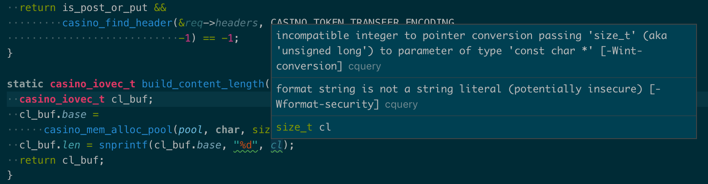

# Hahaha



|asd|asd|
|--|---|
|a|b|
|a|b|
|a|b|

+----+----+
| a  |  b |
+----+----+

MDX Test!

```c
int i = 0;
char *t = "asd";
```

```c
int i = 0;
char *t = "asd";
```

```js
let i = 5
// Error if uncomment this
// function test {}
```
